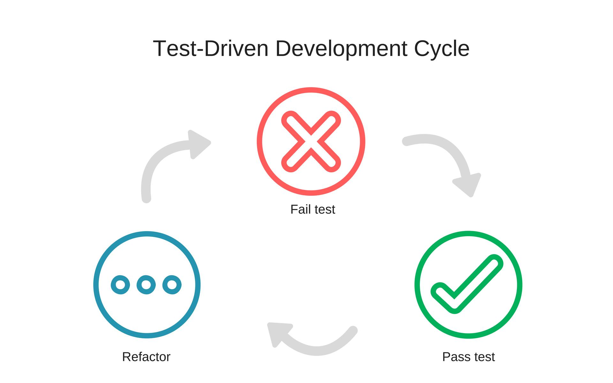

<!-- $theme: default -->

# Developersoverleg - Coding Dojo

###### Jacob Duijzer, 25 april 2019

[](https://www.deviantart.com/blc2030/art/Anime-Karate-Girl-training-at-the-dojo-779891740)

---

# Terminologie

<small>
  
**Dojo**: Een dojo (道場) is een zaal waarin men oefent in Japanse zelfverdedigingskunsten of vechtsporten zoals jiujitsu, judo, karate en aikido of waarin zazen (een vorm van Japanse meditatie) beoefend wordt.

**Kata**: a Japanese word, meaning literally: "form" (型 or 形), is a detailed choreographed pattern of movements made to be practiced alone, but are also practiced within groups and in unison when training. It is practiced as a way to memorize and perfect the movement being executed.

**Randori**: (乱取り) is a term used in Japanese martial arts to describe free-style practice.
</small>

---

# Wat is een Coding Dojo?

```
A Coding Dojo is a meeting where a bunch of coders get
together, code, learn, and have fun.
```

Het doel is om, in een veilige omgeving, gezamelijk te werken aan het oplossen een probleem om zo te werken aan het verbeteren van skills op verschillende gebieden: design, architectuur, unit testen, refactoring, programmeertaal, etc.

---

# Wat is een Code Kata?

Een klein, leuk probleem dat in niet veel meer dan een uur op te lossen valt in een programmeertaal waar je thuis in bent. De regel is dat je dezelfde Kata meerdere keren op lost en elke keer probeert de oplossing en het proces te verbeteren.

---

# Randori

Gezamelijk aan het werk om een Kata op te lossen

---

# Essentiële Dojo elementen

* Introductie en retrospective
* Schrijf zowel tests als code (code zonder tests bestaat niet)
* Laat zien hoe je werkt
* Er is een moderator of facilitator

---

# Randori varianten

* Timebox
* PingPong
* NTests
* Randori in pairs
* Prepared Kata

---

# Randori rules

1. Als jij achter het toetsenbord zit bepaal jij ook wat je typt.
3. Als je achter het toetsenbord zit maar niet weet wat je moet doen vraag je om hulp.
3. Als je om hulp gevraagd wordt geef je zo goed mogelijk antwoord
4. Als je niet gevraagd wordt maar je ziet een mogelijkheid voor verbetering of leerpunten, kies dan een goed moment om dit op te merken. Dit kan betekenen dat je moet wachten tot je zelf aan de beurt bent of zelfs tot bij de retrospective.

---

# Unit Testing 101

* Red-Green-Refactor
* Arrange-Act-Assert
* Naming conventions
* FluentAssertions

---

# Red-Green-Refactor

[](./artwork/Test-Driven-Development-Cycle.jpg)

---

# Red

In the Red state you:
* Declare and name a test
* Arrange - Act - Assert (start by writing the Assert)
* Add just enough production code to satisfy the compiler

Move on to the next state - Green - when:
* Your test describes the missing functionality, executes, and fails.

---

# Green

Change the production code - implement just enough to make the test pass
* Fake it (if you’re unsure)
* When all else fails, remove the failing test, get back to green, and write an easier test.

Move on to the next state - Refactor - when:
* Your tests all execute and pass

---

# Refactor

Change production code: remove fakes, code smells
* Change test code: improve readability
* Don’t add functionality not required by tests
* You might think of new test cases while you’re refactoring: 
	*note them on your list*
* Run the tests after each refactoring. They should continue to pass

Move on to the next state - Red or Overview - when:
* The code is clean and your tests all execute and pass
* Move to the “Red” state if you already know the next test to write

---

# Three rules of TTD by Uncle Bob

1. You are not allowed to write any production code unless it is to make a failing unit test pass.
   
2. You are not allowed to write any more of a unit test than is sufficient to fail; and compilation failures are failures.
   
3. You are not allowed to write any more production code than is sufficient to pass the one failing unit test.

<small>
<center>

[The Three Rules Of TDD](http://butunclebob.com/ArticleS.UncleBob.TheThreeRulesOfTdd)

</center>
</small>

---

# Arrange-Act-Assert

```csharp
[Fact] 
public void ShouldVerifyCallsOrder() 
{ 
	// Arrange 
    var mockService = new Mock<ISomeService>(); 
	mockService.Setup(x => x.GetSomeData()).Returns("somedata");
	

	// Act 
    var result = mockService.GetSomeData();

	// Assert 
    Assert.Equal("somedata", result);
} 
```

---

# Naming conventions

Given_When_Then en vele anderen!

```csharp
public CalculatorShould()
{
    [Fact]
    public void Construct() =>
        new Calculator().Should().BeOfType<Calculator>()
}
```

<small>
<center>

[7 popular naming conventions](https://dzone.com/articles/7-popular-unit-test-naming)

</center>
</small>

---

# FluentAssertions

```csharp
string actual = "ABCDEFGHI";
actual.Should().StartWith("AB").And.EndWith("HI").And.Contain("EF").And.HaveLength(9);
```

```csharp
var recipe = new RecipeBuilder()
                    .With(new IngredientBuilder().For("Milk").WithQuantity(200, Unit.Milliliters))
                    .Build();
Action action = () => recipe.AddIngredient("Milk", 100, Unit.Spoon);
action
                    .Should().Throw<RuleViolationException>()
                    .WithMessage("*change the unit of an existing ingredient*")
                    .And.Violations.Should().Contain(BusinessRule.CannotChangeIngredientQuantity);
```

---

# A Prepared Kata: Leap Years

Write a function that returns true or false depending on
whether its input integer is a leap year or not.

[Kata: Leap Years](http://codingdojo.org/kata/LeapYears/)

---

# Randori in pairs: FizzBuzz

<sub>
  Stel je voor: je bent 11 jaar oud en vijf minuten voor het einde van de les besluit de wiskundeleraar een spelletje te doen: Hij gaat alle leerlingen aanwijzen en ze het opvolgende nummer laten zeggen, te beginnen bij 1. Echter, de grap zit hem er in dat je bij elk nummer dat deelbaar is door 3 "Fizz" moet zeggen. Is het deelbaar door 5? Dan is het "Buzz". De leraar begint met aanwijzen: "een", "twee!", "Fizz", "vier", "Buzz!"...
  
  Totdat jij aan de beurt bent. Je kijkt glazig, de tijd lijkt stil te staan, je krijgt een droge mond, je begint te zweten en net op tijd krijg weet je het: "Fizz!".
</sub>


---

# Randori in pairs: FizzBuzz (2)

<sub>
  Je besluit dat je dit niet meer mag overkomen en je gaat naar huis om een computerprogramma te schrijven dit dit probleem voor je oplost.
</sub>

---

# Randori in pairs: FizzBuzz (3)

De opdracht:

Schrijf een programma met als uitvoer de nummers 1 tot 100. Getallen deelbaar door drie worden vervangen door "Fizz" en getallen deelbaar door vijf met "Buzz". Getallen deelbaar door 3 en 5 worden vervangen met FizzBuzz.

Voorbeeld output:
```
1, 2, Fizz, 4, Buzz, Fizz, 7, 8, Fizz, Buzz, 11, Fizz, 
13, 14, FizzBuzz, 16, 17, Fizz, 19, Buzz, etc
```
---

# Starten

* maak groepjes van 2
* Startproject staat op Github 
	(https://github.com/jacobduijzer/CodingDojoWorkshop)
* BONUS: Maak een fork en doe aan het einde een PR zodat we verschillende oplossingen kunnen zien

---

This page is intentionally left blank

---

# Randori in pairs: FizzBuzzBang (4)

---

# Retrospective

* Ben je tevreden over de oplossing en de code. Is de code "clean"? Zijn er "code smells"?
* Heb je regelmatig kunnen refactoren? Of alleen aan het einde?
* Hoeveel test heb je uiteindelijk?
* What if a new requirement came along that multiples of seven were “Whizz”? Could you add that without editing the existing code? (Cue discussion of the Open-Closed Principle)
* Wat vond je van deze Coding Dojo? Wil je dit vaker doen met andere onderwerpen?

---

# Onderwerpen voor de volgende keer 

###### Datum: 30 mei 2019

---

# Links

* [Coding Dojo Principles](http://codingdojo.org/CodingDojoPrinciples/)
* [Coding Dojo: Test Driven Development](https://www.pluralsight.com/courses/the-coding-dojo) (PluralSight training, Emily Bache)
* [The Coding Dojo Handbook](https://leanpub.com/codingdojohandbook) (Emily Bache)
* [Katas on GitHub](https://github.com/emilybache) (Emily Bache)
* [FluentAssertions](https://fluentassertions.com/)
* [TheThreeRulesOfTdd](http://butunclebob.com/ArticleS.UncleBob.TheThreeRulesOfTdd) (Uncle Bob)
* [BLC2030](https://www.deviantart.com/blc2030/art/Anime-Karate-Girl-training-at-the-dojo-779891740), Devian Art author if dojo image
